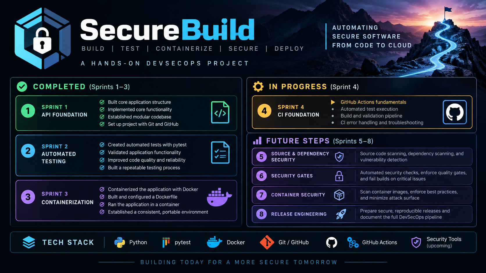

# SecureBuild

  

## Project Overview

SecureBuild is a hands-on security engineering project designed to demonstrate how a small Python/FastAPI application can be progressively built, tested, containerized, automated, and secured through a CI/CD pipeline.

The project is being developed across multiple sprints, with each sprint introducing a new engineering or security layer. The goal is to build a pipeline where no release artifact is approved unless all required functional and security checks pass.

## Current Progress

### Completed
- Sprint 1 — API Foundation
- Sprint 2 — Automated Testing with pytest
- Sprint 3 — Docker Containerization and Hardening

### In Progress
- Sprint 4 — CI Foundation with GitHub Actions

### Planned
- Sprint 5 — Source & Dependency Security
- Sprint 6 — Security Gates
- Sprint 7 — Container Security
- Sprint 8 — Release Engineering

## Current Features

- Python/FastAPI application
- REST API endpoints
- Automated pytest testing
- Docker containerization
- Non-root container execution
- Docker build-context hardening
- Container inspection and troubleshooting
- Git and GitHub version control
- CI fundamentals with GitHub Actions in progress

## Security Concepts Demonstrated

- Least privilege
- Defense in depth
- Reproducible environments
- Attack-surface reduction
- Dependency awareness
- Automated validation
- Failure testing and troubleshooting
- Security-focused release gating

## Project Goal

The long-term objective is to build a security-focused software delivery pipeline that:

Builds  
↓  
Tests  
↓  
Analyzes  
↓  
Scans  
↓  
Applies security gates  
↓  
Approves or rejects release

No release artifact should be considered approved unless the required functional and security checks pass.

## Technology Stack

- Python
- FastAPI
- pytest
- Docker
- Git
- GitHub
- GitHub Actions
- Additional security tooling planned for later sprints